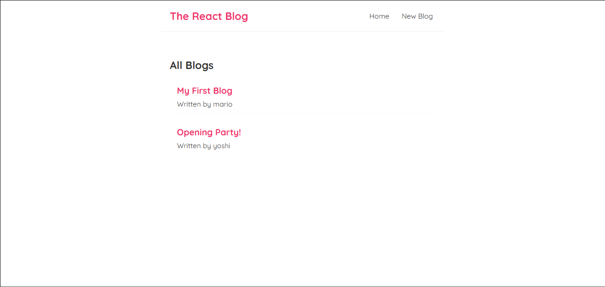
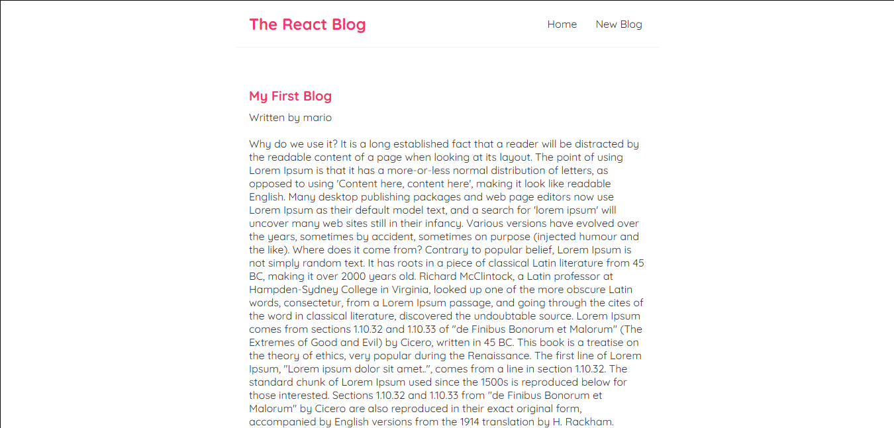
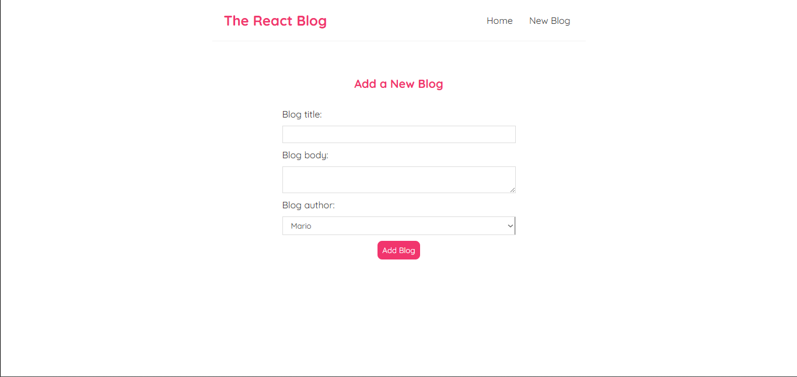

# Blog React Project


A simple blog application built with React, featuring client-side routing, API integration, and full CRUD functionality using JSON Server.

## Features
- Blog post creation/display
- Dynamic routing with React Router
- Blog deletion functionality
- Custom hook for fetching data (`useFetch`)
- Loading and error handling
- 404 page for unmatched routes
- Fully functional blog list using JSON Server as a backend mock

## Screenshots
| Homepage | Blog Details | Create Page |
|----------|--------------|----------|
|  |  |  |

## Tech Stack
- **Frontend**: React, React Router
- **API**: JSON Server
- **CSS**: Custom styling

## What I Learned
- React Router for client-side routing
- Dynamic routing and route parameters
- API integration with JSON Server
- Custom hooks in React
- Controlled inputs in forms for better state management
- Error handling and loading indicators in React

## Configuration
To run this project locally, follow the instructions below:

1. **Clone the repository**:
   ```bash
   git clone https://github.com/your-username/blog-react.git
   ```
2. **Navigate into the project folder:**
   ```bash
   cd blog-project
   ```
3. **Run the development server:**
   ```bash
   npm start
   ```
4. **Run the JSON Server in a separate terminal window:**
   ```bash
   npx json-server --watch data/db.json --port 8000
   ```

## Project Structure
  ```
  blog-react/
  ├── components/      # React components
  │   ├── BlogDetails.js  # Blog post details page
  │   ├── BlogList.js     # Blog list page
  │   ├── Navbar.js       # Navigation bar
  │   └── NotFound.js     # 404 page component
  ├── hooks/            # Custom React hooks
  │   └── useFetch.js    # Custom hook for fetching data
  ├── data/             # Mock data for JSON Server
  │   └── db.json        # Blog data file
  ├── App.js            # Main app component
  ├── index.js          # Entry point for React app
  └── README.md         # This file
  ```

## Development Notes
- Implemented a delete button for blog posts
- Added a custom hook (useFetch) to handle data fetching
- Implemented client-side routing with React Router
- Styled the app using CSS for better UI

## License
MIT License - See [LICENSE](LICENSE) for details
